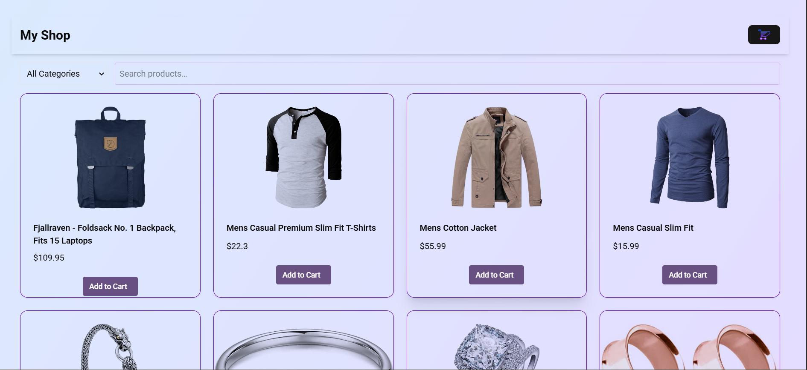
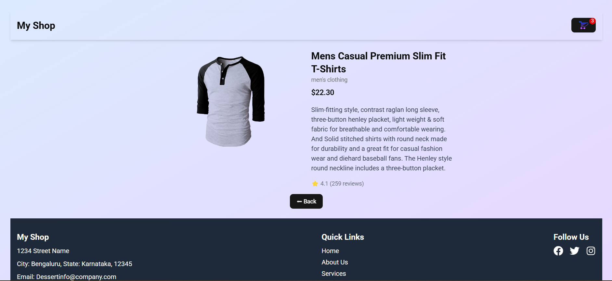
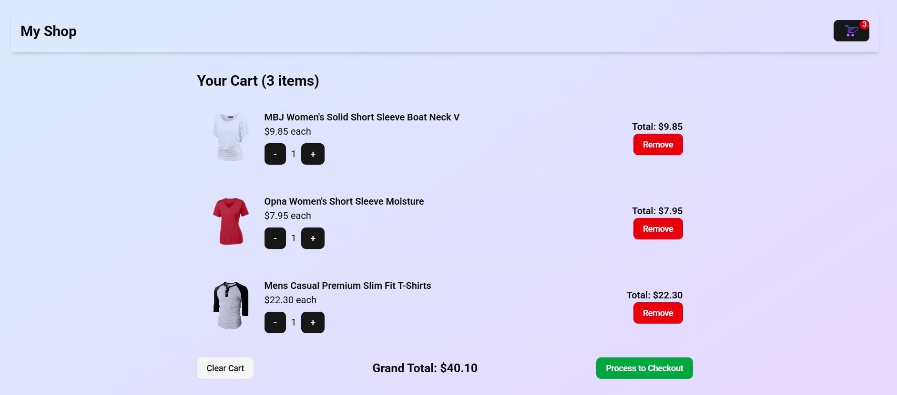
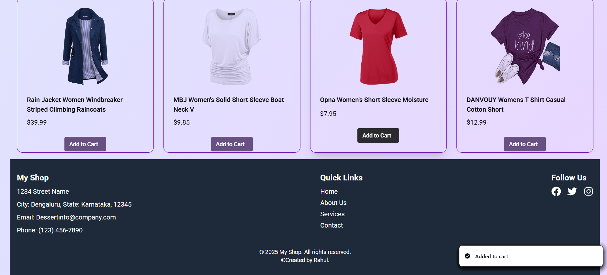

# React + TypeScript + Vite

# 🛒 MyShop

A modern e-commerce UI built with **React**, **Vite**, **TypeScript**, **Tailwind CSS**, and **ShadCN UI**, featuring product browsing, filtering, and cart management with persistent local storage.

---

## 🚀 Technologies Used

- **React** – Frontend framework for building UI components
- **Vite** – Fast development and build tool
- **TypeScript** – Type-safe JavaScript for improved DX and scalability
- **Tailwind CSS** – Utility-first CSS framework for rapid styling
- **ShadCN UI** – Beautiful accessible UI components built on top of Radix and Tailwind
- **React Router** – Client-side routing for SPA navigation
- **React Icons** – Icon library integration for React
- **Sonner (toast)** – Clean and customizable toast notifications
- **localStorage** – Browser API to persist cart and product data

---

## 🛠️ Setup Instructions

1. **Clone the repository**  
   ```bash
   git clone https://github.com/Rahulkrpd/MyShop.git
   cd MyShop


2. **Install dependencies**  
   ```bash
    npm install


2. **Run the app**  
   ```bash
    npm run dev


## 📸 Screenshots

### 🏠 Home Page – Product Listing with Filters & Search  


### 📄 Product Details Page  


### 🛒 Cart Page with Quantity Controls  



### 🛒 Footer page Contact Us  



## 📦 Key Dependencies & Purpose

| Package                 | Why It's Used                                                     |
|-------------------------|-------------------------------------------------------------------|
| `react`                 | Core UI library                                                   |
| `vite`                  | Lightning-fast dev server and bundler                             |
| `typescript`            | Ensures type safety across components                             |
| `tailwindcss`           | Rapid and responsive styling using utility classes                |
| `@shadcn/ui`            | Prebuilt Tailwind-based accessible UI components                  |
| `react-router-dom`      | Handles route navigation (e.g. Home, Product, Cart)               |
| `react-hot-toast` / `sonner` | Toast notifications (e.g. add to cart)                      |
| `react-icons`           | Lightweight icon integration                                      |

---

## ✨ Features

- 🔍 **Search & Filter** by product title or category  
- 🛒 **Cart System**  
  - Add/remove products  
  - Quantity control with +/- buttons  
  - View total price  
  - Persist cart across refresh via `localStorage`  
- 📄 **Product Detail View**  
  - View full description, rating, and price  
- ✅ **Toast notifications** on important actions  
- 💾 **Data caching**: Products are saved locally to avoid refetching  

---


## 👤 Created By

**Rahul**  
🔗 GitHub: [https://github.com/Rahulkrpd/MyShop](https://github.com/Rahulkrpd/MyShop)
